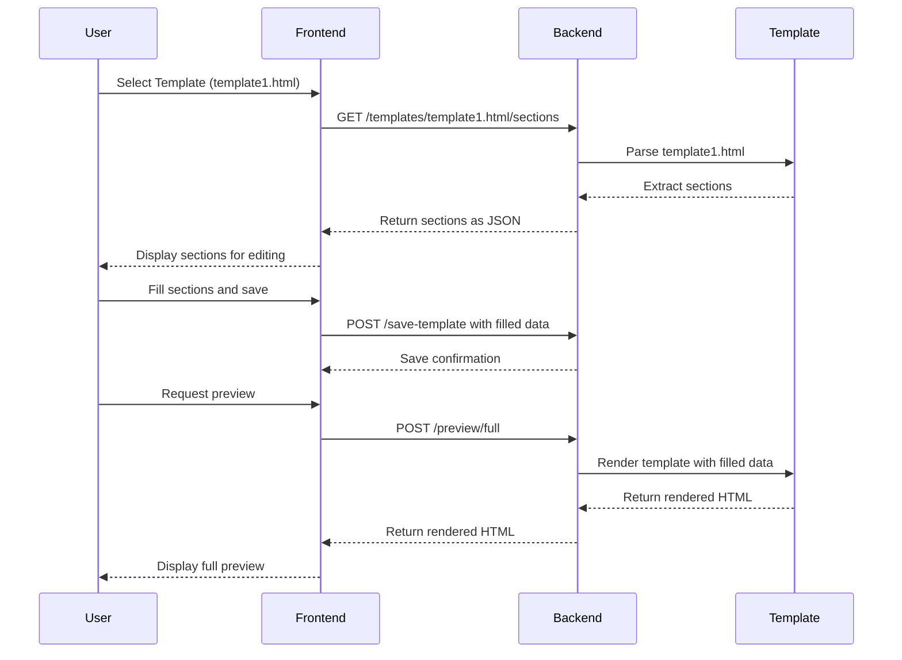

# Newsletter App

## Table of Contents
- [Objective](#objective)
- [Example of Using a Template](#example-of-using-a-template)
- [Backend Endpoints](#backend-endpoints)
- [Frontend URLs](#frontend-urls)
- [Tools and Technologies](#tools-and-technologies)
- [Installation and Setup](#installation-and-setup)
- [Mermaid Diagram: Sequence Flow](#mermaid-diagram-sequence-flow)

## Objective
The **Newsletter App** is designed to help organizations create and manage monthly newsletters using pre-defined templates. Authors can:
- Select a template.
- Dynamically fill in sections (e.g., Trending Technology, Ongoing Work, Success Stories, General Trivia).
- Preview the newsletter.
- Save the filled data for review or further editing.

---

## Example of Using a Template
1. **Select a Template**:
   - Navigate to the template selection page.
   - Choose a template (e.g., `template1.html`).

2. **Fill Sections**:
   - Dynamically fetched sections (e.g., "Trending Technology") are displayed.
   - Fill in the title, abstract, link, and upload a thumbnail for each section.

3. **Preview the Newsletter**:
   - View the fully rendered newsletter with the filled sections.

4. **Save the Data**:
   - Save the filled data to the backend for future use or review.

---

## Backend Endpoints

### 1. List Templates
- **Endpoint**: `GET /templates`
- **Description**: Returns a list of available templates.
- **Response**:
  ```json
  ["template1.html", "template2.html"]
  ```

### 2. Get Template
- **Endpoint**: `GET /templates/{template_name}`
- **Description**: Fetches the HTML content of a specific template.
- **Response**: HTML content of the template.

### 3. Get Template Sections
- **Endpoint**: `GET /templates/{template_name}/sections`
- **Description**: Dynamically extracts sections from the specified template.
- **Response**:
  ```json
  [
    {
      "category": "Trending Technology",
      "title": "",
      "abstract": "",
      "link": "",
      "thumbnail_url": ""
    },
    {
      "category": "Ongoing Work",
      "title": "",
      "abstract": "",
      "link": "",
      "thumbnail_url": ""
    }
  ]
  ```

### 4. Save Template Data
- **Endpoint**: `POST /save-template`
- **Description**: Saves the filled template data as JSON.
- **Payload**:
  ```json
  [
    {
      "category": "Trending Technology",
      "title": "Tech News",
      "abstract": "Latest trends in AI",
      "link": "https://example.com",
      "thumbnail_url": "/static/images/tech.jpg"
    },
    {
      "category": "Ongoing Work",
      "title": "Work Updates",
      "abstract": "Current projects and progress",
      "link": "https://example.com",
      "thumbnail_url": "/static/images/work.jpg"
    },
    {
      "category": "Success Stories",
      "title": "Success Story",
      "abstract": "How AI transformed a business",
      "link": "https://example.com",
      "thumbnail_url": "/static/images/success.jpg"
    },
    {
      "category": "General Trivia",
      "title": "Trivia",
      "abstract": "Fun facts about technology",
      "link": "https://example.com",
      "thumbnail_url": "/static/images/trivia.jpg"
    }
  ]
  ```
- **Response**:
 ```json
  {"status": "success", "message": "Template data saved successfully"}
  ```

### 5. Get Saved Template Data
- **Endpoint**: `GET /get-template-data`
- **Description**: Fetches the saved template data.
- **Response**:
  ```json
  [
    {
      "category": "Trending Technology",
      "title": "Tech News",
      "abstract": "Latest trends in AI",
      "link": "https://example.com",
      "thumbnail_url": "/static/images/tech.jpg"
    },
    {
      "category": "Ongoing Work",
      "title": "Work Updates",
      "abstract": "Current projects and progress",
      "link": "https://example.com",
      "thumbnail_url": "/static/images/work.jpg"
    },
    {
      "category": "Success Stories",
      "title": "Success Story",
      "abstract": "How AI transformed a business",
      "link": "https://example.com",
      "thumbnail_url": "/static/images/success.jpg"
    },
    {
      "category": "General Trivia",
      "title": "Trivia",
      "abstract": "Fun facts about technology",
      "link": "https://example.com",
      "thumbnail_url": "/static/images/trivia.jpg"
    }
  ]
  ```

### 6. Preview Full Template
- **Endpoint**: `POST /preview/full`
- **Description**: Renders a full preview of the template with the filled sections.
- **Payload**:
  ```json
  {
    "template_name": "template1.html"
  }
  ```

---

## Frontend URLs

### 1. Home Page
- **URL**: `/`
- **Description**: Landing page with an introduction to the app.

### 2. Template Selection
- **URL**: `/templates`
- **Description**: Allows the user to select a template.

### 3. Section Form
- **URL**: `/section-form/:template`
- **Description**: Displays the sections of the selected template for editing.

### 4. Section Preview
- **URL**: `/section-preview`
- **Description**: Allows the user to preview the filled sections.

### 5. Template Preview
- **URL**: `/template-preview/:template`
- **Description**: Displays the rendered template with the filled sections.

### 6. Full Preview
- **URL**: `/preview/:template`
- **Description**: Displays the final rendered newsletter.

---

## Tools and Technologies

### Frontend
- **Framework**: Angular 15+
- **Language**: TypeScript
- **Styling**: Bootstrap 5.3

### Backend
- **Framework**: FastAPI 0.95+
- **Language**: Python 3.10+
- **Libraries**:
  - `beautifulsoup4`: For parsing HTML templates.
  - `uvicorn`: For running the FastAPI server.

---

## Installation and Setup

### Backend (Python)

#### For macOS and Windows
1. **Clone the Repository**:
   ```bash
   git clone <repository-url>
   cd backend
   ```

2. **Create a Virtual Environment**:
   ```bash
   python -m venv venv
   source venv/bin/activate  # macOS/Linux
   venv\Scripts\activate     # Windows
   ```

3. **Install Dependencies**:
   ```bash
   pip install -r requirements.txt
   ```

4. **Run the Backend**:
   ```bash
   uvicorn app.main:app --reload
   ```

5. **Access the Backend**:
   - Open `http://localhost:8000/docs` to view the API documentation.

---

### Frontend (Angular)

#### For macOS and Windows
1. **Install Node.js**:
   - Download and install Node.js from [https://nodejs.org](https://nodejs.org).

2. **Install Angular CLI**:
   ```bash
   npm install -g @angular/cli
   ```

3. **Navigate to the Frontend Directory**:
   ```bash
   cd frontend
   ```

4. **Install Dependencies**:
   ```bash
   npm install
   ```
5. **Run the Frontend**:
   ```bash
   ng serve
   ```

6. **Access the Frontend**:
   - Open `http://localhost:4200` in your browser.

---

## Mermaid Diagram: Sequence Flow

